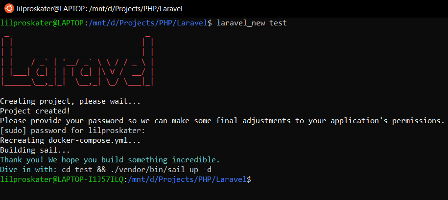

# laravel new for Linux
<p align="center"></p>


## Installation
```
sudo apt install docker
sudo systemctl enable docker
sudo systemctl restart docker
sudo groupadd docker
sudo usermod -aG docker ${USER}
```
Logout and login back
```
cd /usr/local/bin
sudo git clone https://github.com/N0n3-github/laravel_new_linux.git
sudo mv ./laravel_new_linux/laravel_new ./
sudo rm -rf ./laravel_new_linux
```

## Usage
```
laravel_new <project_name>
cd <project_name>
./vendor/bin/sail up -d
```

## Accessing Project
```
http://localhost
```

## Accessing PhpMyAdmin
```
http://localhost:8080
```

## MySQL
```
username: sail/root
password: password
```
